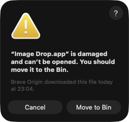

# PicFetch

[](https://github.com/frathe/picfetch/actions/workflows/ci.yml)
[](https://github.com/frathe/picfetch/releases/latest)
[](go.mod)
[](https://github.com/frathe/picfetch/commits/main)
[](https://github.com/frathe/picfetch/releases)
[](LICENSE)
[](https://buymeacoffee.com/gcobnk0grj)
[](https://github.com/frathe/picfetch/releases/latest)
[](https://github.com/frathe/picfetch/releases/latest)
[](https://github.com/frathe/picfetch/releases/latest)
[](https://frathe.github.io/picfetch/)
[](translations/en.json)
[](translations/de.json)


A small [Fyne](https://fyne.io/) desktop app for quickly viewing images.
Drop one or more images onto the window to view them, and step through the
set with the keyboard.

## usage demo (click for longer demo video)

[](https://vimeo.com/1220283616)

## Features

- Drag-and-drop viewing of JPEG, PNG, GIF, WebP, BMP, TIFF, ICO, XPM, HEIC,
  AVIF, SVG, and camera RAW (`.jpg`, `.jpeg`, `.jpe`, `.jfif`, `.png`, `.gif`, `.webp`,
  `.bmp`, `.tif`, `.tiff`, `.ico`, `.xpm`, `.heic`, `.heif`, `.avif`, `.svg`,
  `.cr2`, `.cr3`, `.nef`, `.arw`, `.dng`, `.orf`, `.rw2`, `.raf`, and other
  common RAW extensions, or anything reporting a matching `image/*` MIME type).
  RAW files show the camera's embedded JPEG preview — marked `(preview)` in
  the title and info overlay — with no demosaic engine. HEIC/AVIF decode
  through embedded WASM (no cgo), so they need no system libraries and don't
  complicate cross-compilation. SVG is rasterized on the fly and re-rendered
  as you zoom, so it stays sharp at any zoom level
- On macOS, the same format list also opens through Finder's **Open With**,
  a drop on the Dock icon, `open -a`, or double-clicking a file already
  associated with PicFetch — whether PicFetch is already running or being
  launched cold by that click, and a folder can be dropped on the Dock icon
  too
- Animated GIFs play back frame-by-frame at their encoded speed, correctly
  compositing each frame per its disposal method (a partial-region update
  won't leave stale pixels or wrongly clear the whole frame); playback stops
  automatically as soon as you navigate away

- EXIF orientation correction for JPEGs (auto-rotate/flip per the file's
  orientation tag)
- EXIF data window (`E`, or a link in the info overlay) showing camera
  make/model, lens, exposure, aperture, ISO, focal length, capture date,
  and the capture coordinates, for files that carry them — plus a
  collapsible OpenStreetMap view pinned at the capture location for photos
  with GPS tags (collapsed on every open, so no map tiles are fetched
  unasked)
- Drop one image to step through the other images in the same folder
  with the arrow keys (wraps around at both ends), or drop several files /
  a folder to walk that set; jump to the first/last with `Home`/`End`
- `G` opens a full-window thumbnail grid for jumping around a large drop by
  sight instead of arrowing through it; click a thumbnail, or use the arrow
  keys to move a highlight and `Return` to open it. Thumbnails are generated
  lazily and with bounded concurrency, in a separate small LRU cache from
  the full-size decode cache, so opening it on a several-thousand-file
  folder doesn't spawn a decode per file
- Favorites remember named file lists; each entry shows how many files it
  holds (`Holiday 2024 (128)`), and **Manage Favorites…** (also
  `Cmd`/`Ctrl+Shift+F`) is fully keyboard-navigable — arrow keys move a ring
  over the rows and their Open/Remove buttons, `Return` activates whichever
  is ringed. **Add Current List to Favorites…** is also `Opt`/`Alt+Shift+F`.
  The **Add to Favorites…** and **Replace Favorite** prompts are
  keyboard-driven too, with the name field auto-focused on open. Opening or
  saving a favorite also saves its grid previews to disk under that
  favorite's own folder in the background, so reopening it paints the grid
  without re-decoding the originals (toggle this off in Settings)
- Zoom via `+`/`-`/`1`/`0`, or scroll (mouse wheel/trackpad) to zoom
  anchored at the cursor; click-drag or Shift+scroll to pan once zoomed in.
  No native pinch gesture — Fyne's desktop driver (GLFW) has no magnify/
  gesture callback, only scroll wheel, so Shift+scroll is the stand-in
- A plain drop replaces the current set; press `M` to toggle merge mode,
  which makes drops add to the set instead (no dedup — dropping the same
  file twice adds it twice). The title bar shows a `[merge]` prefix while
  it's on. It's a standing toggle rather than a drag modifier because
  drag-and-drop from the file manager never focuses the window, so OS-level
  modifier keys (Shift, etc.) held during the drag aren't observable
- Files are naturally sorted by name by default (`IMG_2.jpg` before
  `IMG_10.jpg`), not just the raw order the OS handed them over in; press
  `S` to cycle through capture date, modification time, file size, and the
  raw scan/drop order, and back to name. The title bar shows which one is
  active (`[sort: date]`, `[unsorted]`, etc.) except for the default
- Drop a mix of files and folders — folders are scanned recursively for
  supported images, with a spinner and a live counter shown while scanning
  large trees
- A file that fails to decode only once you navigate to it is dropped from
  the set and the next one is loaded automatically (wrapping around if it
  was the last), instead of leaving the title/position stuck on a file
  that isn't actually shown
- `Escape` closes the window
- Built-in end-user manual ([manual.md](internal/ui/help/manual.md), embedded at build time and
  rendered in its own scrollable window) via `F1` or **Help → Manual**
  (F1 is shown next to that menu item); the window has a search bar at the
  top — Enter finds and highlights matches and scrolls to the first, Enter
  again jumps to the next. `Escape` closes just the manual window. Fyne's
  markdown renderer has no table extension, so keep `manual.md` table-free
- Window auto-resizes to fit the image, capped at 1500x950
- Image decoding happens off the UI thread so large files don't freeze the
  window; an indeterminate progress bar shows along the top edge while a
  decode is in flight
- Localized UI strings via `translations/*.json` (`fyne.io/fyne/v2/lang`),
  currently shipping English and German
- Merge mode, sort order, the picture-frame slideshow interval, and the
  (empty-dropzone) window size are remembered across launches, via Fyne's
  `Preferences` API


## Download

Pre-built binaries for Linux, Windows, and macOS are published on the
[Releases page](https://github.com/frathe/picfetch/releases) — no Go
toolchain required. macOS builds are published for both Apple Silicon
(`picfetch-macos-arm64.zip`) and Intel (`picfetch-macos-x86_64.zip`), and
Windows builds for both x64 (`picfetch-windows-amd64.zip`) and ARM64
(`picfetch-windows-arm64.zip`); grab the one matching your machine. See
[Building](#building) below to build from source instead.

### Windows (Microsoft Store)

[](https://apps.microsoft.com/detail/9p0dm0kth01k?ocid=webpdpshare)

### Windows (WinGet)

```powershell
winget install io.github.frathe.picfetch
```

Releases are immutable. GitHub issues a Sigstore release attestation that
binds each archive's SHA-256 to the tag. The in-app updater, when enabled,
refuses to install a build that fails that check.

### macOS: "app is damaged" warning



The release build isn't signed with an Apple Developer ID or notarized, so
Gatekeeper quarantines it after download and shows this message. The app
isn't actually corrupted — to open it anyway:

- Right-click (Control-click) `PicFetch.app` → **Open** → confirm in the
  dialog that appears, or
- Run `xattr -cr "/path/to/PicFetch.app"` in Terminal to clear the
  quarantine flag, then open it normally.


## Requirements

- Go 1.27.1 or newer (see the `go` directive in [go.mod](go.mod))
- A C toolchain for cgo (Fyne's OpenGL bindings require it) — Xcode Command
  Line Tools on macOS, `gcc` + `libgl1-mesa-dev`/`xorg-dev` on Linux
- [Docker](https://www.docker.com/) — used by `make test`/`make verify` so
  tests and golden comparisons run on Linux/amd64 like CI, and also needed
  for cross-compilation and `make golden`
- The [GitHub CLI](https://cli.github.com/) (`gh`) — only needed for
  `make security-github` and the combined `make security` target. It must be
  installed separately (e.g. `brew install gh`) and authenticated via
  `gh auth login`. `make security-govulncheck` runs the repository-pinned
  [`govulncheck`](https://go.dev/security/vuln) through Go, with no separate
  installation required

## Running

```sh
make run
# or
go run .
```

### Command-line flags

`picfetch` opens the files and folders it is given, and takes a few flags that
set up the launch. Run `picfetch --help` for the same list.

| Flag | Effect |
|------|--------|
| `--slideshow` | Start in picture-frame mode once the given files have loaded. |
| `--shuffle` | Advance to a random file in picture-frame mode. |
| `--interval=DURATION` | Picture-frame auto-advance interval, e.g. `8s` or `1m30s`. |
| `--sort=MODE` | Order the file set: `name`, `date`, `modified`, `size`, or `drop`. |
| `--merge` | Merge the opened files into the current set instead of replacing it. |
| `--max-files=N` | Stop a scan after N images. |
| `--help` | Print the flag list and exit. |

Flags may appear anywhere among the paths, `-flag` reads the same as `--flag`,
and values take either `--flag=value` or `--flag value`. Boolean flags take
`--flag` or `--flag=false`. Use `--` to end flag parsing when a path starts
with a dash. An unrecognized flag is an error and exits 2 rather than starting
with the flag ignored.

**Every flag applies to that launch only.** None of them change the settings
saved in the Settings window, so `picfetch --shuffle ~/photos` shuffles this
once and leaves your standing preferences alone.

A photo frame that starts with the machine is then just:

```sh
picfetch --slideshow --shuffle --interval=20s /srv/photos
```

## Building

All build tasks are defined in the [Makefile](Makefile). Run `make help` to
list them.

| Command                | Description                                                                                        |
|------------------------|----------------------------------------------------------------------------------------------------|
| `make build`           | Native binary for the current OS/arch, output to `bin/picfetch`                                    |
| `make package-mac`     | macOS `.app` bundle, output to `bin/PicFetch.app` (no Docker required)                             |
| `make package-windows` | Windows `.exe` files, cross-compiled via `fyne-cross`/Docker, to `bin/picfetch-windows-<arch>.exe` |
| `make package-windows-store` | Store-managed Windows `.exe` inputs for the MSIX workflow, to `bin/picfetch-microsoft-store-<arch>.exe` |
| `make package-linux`   | Linux binaries, cross-compiled via `fyne-cross`/Docker, to `bin/picfetch-linux-<arch>`             |
| `make build-all`       | Runs `package-mac`, `package-windows`, and `package-linux`                                         |
| `make install-tools`   | Installs the `fyne` and `fyne-cross` CLIs used by the packaging targets                            |

Packaging is done with the [`fyne`](https://pkg.go.dev/fyne.io/fyne/v2/cmd/fyne)
CLI (native OS builds) and [`fyne-cross`](https://github.com/fyne-io/fyne-cross)
(Windows and Linux, via Docker containers with the appropriate cross toolchain
— cgo can't be cross-compiled from macOS without it). `package-windows` and
`package-linux` each build one binary per architecture listed in `WIN_ARCHES`
and `LINUX_ARCHES` respectively (both default to `amd64 arm64`), named
`bin/picfetch-windows-<arch>.exe` and `bin/picfetch-linux-<arch>` so they
don't collide; override on the command line for a single arch, e.g. `make
package-linux LINUX_ARCHES=arm64` or `make package-windows WIN_ARCHES=amd64`.
`fyne-cross windows` also supports `386`, and `fyne-cross linux` also supports
`386` and `arm`.

Microsoft Store delivery uses the separate `package-windows-store` target and
the Windows SDK packaging workflow documented in
[docs/microsoft-store.md](docs/microsoft-store.md). Store builds leave updates
to Microsoft Store instead of using PicFetch's GitHub self-updater.

> **Note:** running an `amd64` Linux binary under an x86 emulator (e.g.
> Box64) on ARM hardware is unreliable for OpenGL apps like this one — build
> the matching `arm64` binary for ARM boards instead of emulating.

There are also `-debug` variants (`package-windows-debug`,
`package-linux-debug`) that build an unstripped binary with debug symbols
kept in, useful for diagnosing startup failures that only show up in a
packaged build.

> **Note:** `fyne package` bumps the `Build` field in
> [FyneApp.toml](FyneApp.toml) on every run. That's expected Fyne behavior,
> not a bug — decide for yourself whether to commit those bumps.

### Other development commands

| Command                     | Description                                                         |
|-----------------------------|---------------------------------------------------------------------|
| `make fmt`                  | `goimports -local github.com/frathe/picfetch` all Go source files   |
| `make fmt-check`            | Fail if any file differs from that `goimports` (CI format gate)     |
| `make vet`                  | `go vet ./...`                                                      |
| `make update-test-image`    | Pull the latest Linux/amd64 Ubuntu image used by Docker tests       |
| `make test`                 | Run `go test -timeout 30m ./...` in Linux/amd64 Docker, matching CI and golden rendering |
| `make test-native`          | Run the same suite directly on the host (goldens can differ outside Linux/amd64) |
| `make verify`               | The same gate CI runs; its race-test step uses the `make test` Linux/amd64 container |
| `make tidy`                 | `go mod tidy` — tidy go.mod / go.sum                                |
| `make security`             | Run all security checks (govulncheck + GitHub Dependabot alerts)    |
| `make security-govulncheck` | Scan dependencies with the repository-pinned `govulncheck`          |
| `make security-github`      | List open GitHub Dependabot alerts via `gh` (needs `gh auth login`) |
| `make clean`                | Remove `bin/`, `fyne-cross/`, and any stray packaged app/zip        |

> **Note:** `make security-github` requires the [GitHub CLI](https://cli.github.com/)
> (`gh`) to be installed and authenticated (`gh auth login`), and it must be run
> from a checkout with a GitHub `origin` remote.

`make security-govulncheck` invokes the version declared as a tool dependency
in [go.mod](go.mod), so its first run may download that pinned module.

### Releasing

```sh
make release              # patch bump, e.g. 0.1.7 -> 0.1.8
make release PART=minor   # or PART=major
```

`make release` is the whole flow. It refuses to start unless you're on `main`
(override with `RELEASE_BRANCH=`), the working tree is clean, and `HEAD`
matches `origin/main`; it also refuses if the tag it would create already
exists locally or on the remote. After a confirmation prompt (`YES=1` skips
it) it runs `make verify`, bumps `Version`/`Build` in
[FyneApp.toml](FyneApp.toml), writes GitHub release notes from the `## Done`
section of [todos.md](todos.md) (empty categories dropped, plus a Full
Changelog compare link) into `.github/release-notes.md`, clears those Done
items so they are not reused, commits that as `Release vX.Y.Z`, tags the
commit, and pushes the branch and the tag. The confirmation prompt prints the
notes first; a Done section with no list items aborts. If the GitHub CLI (`gh`) is
installed it then finds the Release workflow run for that tag (without
prompting you to pick among the simultaneous CI run on `main`) and
follows it until the artifacts are published.

Pushing the tag is what publishes: [`.github/workflows/release.yml`](.github/workflows/release.yml)
re-runs the full CI suite as a gate, then packages macOS, Windows, and Linux
artifacts and attaches them to a GitHub release whose body is
`.github/release-notes.md` from the tagged commit. Nothing is published if that
run goes red — the tag just sits there, and you can delete it and try again.
The download links on the [website](https://frathe.github.io/picfetch/) point
at `releases/latest`, so they need no edit per release.

`make bump-version` does only the FyneApp.toml edit (no commit, no tag, no
push) for the rare case where you want the version bumped by itself.

## Testing

`make test` runs everything in an Ubuntu 24.04 Linux/amd64 container: unit
tests colocated with the code they cover (`internal/ui/*_test.go`,
`internal/imaging/*_test.go`, and so on) plus the end-to-end suite below. It
keeps Docker volumes for the Go build and module caches, so later runs reuse
the downloaded toolchain and dependencies. Run `make update-test-image` to
refresh the cached Ubuntu image from its upstream tag before testing.
`make test-native` is the direct host equivalent when platform-specific
behavior is the point, but its golden pixels can differ outside Linux/amd64.
Shared test fixtures — synthetic images in every supported format, temp files,
and stubs for the OS-level seams — live in `internal/uitest`.

### End-to-end suite (`internal/ui/e2e_test.go`)

Rather than a hand-copied replica of the UI that could drift out of sync,
the e2e tests drive the *real* app: `buildViewer(application fyne.App,
startup startupState)` in [internal/ui/build.go](internal/ui/build.go) is
the exact top-level widget/handler wiring `Run` uses, including the ordered
feature construction in [internal/ui/features.go](internal/ui/features.go), after
[internal/ui/startup.go](internal/ui/startup.go) loads startup state. Every
test in the package mirrors that load/build/geometry-restoration path
through `newTestUI`, then drives it the way a user would — `handleDrop` for
a drop, `handleKeyEvent` for a key press — and checks two things:

- **State** — `v.files`, `v.index`, and widget visibility (`.Visible()`).
  Fast, exact, and portable; this is the real regression guard.
- **A screenshot** — the full window, captured via `win.Canvas()` and
  compared against a golden master PNG in `internal/ui/testdata/` using Fyne's own
  `test.AssertRendersToImage`. This catches appearance/z-order bugs state
  alone can't see — it's what caught the "stale image left behind an error
  toast" regression during development.

Run just this suite natively with the command below. On a non-Linux/amd64 host,
use `make golden` when the screenshot verdict itself matters.

```sh
go test -run TestE2E -v ./...
```

**Updating a golden master:** if a legitimate visual change makes one
stale, regenerate it with `make golden` rather than a plain `go test` -
Fyne's software rasterizer renders slightly different anti-aliased pixels
depending on CPU architecture (its own test harness even special-cases
darwin/arm64 for this), so a master captured by running `go test` directly
on a non-amd64-Linux machine can pass there and still fail in CI, which
runs on `ubuntu-latest`/amd64 with no such leniency. `make golden` renders
inside a `linux/amd64` container matching CI exactly (needs Docker), so the
result is never machine-dependent. Either way, the new render lands at
`internal/ui/testdata/failed/<name>.png` (gitignored — never committed) and
the failure reports that path. Inspect it, and if it looks right, copy it
over `internal/ui/testdata/<name>.png` to accept it as the new baseline.

**Known gap:** F1/the manual window isn't covered. Fyne's test theme only
defines fonts for 6 specific `TextStyle` combinations, and the manual's
markdown produces at least one combination outside that set, so measuring
it panics on a nil font resource — a limitation in Fyne's test theme, not
in this app.

**A note on background goroutines:** `go test` runs a package as one
process, and Fyne's test driver runs `fyne.Do` callbacks inline on the
calling goroutine rather than marshaling them to a UI thread — so a
goroutine that outlives the test that started it will do UI work in the
middle of a later, unrelated one. Every background operation therefore has
a completion signal, and the suite has a helper to wait on it: `settleToast`
after anything that raises a toast, `settleThumbs`/`settleSlideshow`/
`settleChooser` for the grid, picture-frame mode, and the file dialog, and
`dropAndWait` (which covers the scan, the load, and its neighbor preloads)
for a drop. Add the matching wait if you add a scenario that starts one.

## Project layout

```text
main.go                   Thin entry point: app setup, translations, CLI paths
internal/
  ui/                     Viewer state, app composition, and key dispatch
    run.go                Explicit startup/runtime/shutdown lifecycle
    startup.go            Startup state, defaults, and geometry restoration
    build.go              Top-level window and overlay composition
    components.go         App-owned widget clusters and layout
    features.go           Ordered construction of feature modules
    shortcuts.go          Global modified-key shortcut registration
    zoom/ grid/           Feature packages that own their widgets and state
    deletion/ slideshow/
    exifwin/ favorites/
    settingswin/ help/
    spiral/
    autoupdate/           Update orchestration and cached update state
    display/ infoview/    Viewer-decoupled display, info, and menu state
    menus/
    widgets/              Shared viewer-free UI mechanics
    assets/               Embedded placeholder and welcome artwork
    help/manual.md        Embedded end-user manual
    testdata/             Golden screenshots for the end-to-end suite
  imaging/                Probe, decode, orient, encode, and image caches
  update/                 Verified download, staging, and platform apply logic
  appearance/             Application-wide light/dark appearance handling
  preferences/ session/   Standing preferences and last-open file sets
  filescan/ filesort/     File discovery and ordering
  dupes/ selection/       Duplicate detection and selection helpers
  favstore/ favthumbs/    Favorite lists and their cached grid previews
  clipboard/ filepicker/  Platform integrations behind testable dispatchers
  trash/ wallpaper/
  openwith/               macOS Apple Event open queue
  completion/ decodepool/ Background-work coordination primitives
  wingesture/ winpos/     Window gesture and position tracking
  uitest/                 Shared fixtures, UI queues, and OS seam stubs
translations/             Embedded JSON translation bundles
assets/                   Application icon and README artwork
docs/agents/              Agent-facing domain and issue-triage guidance
scripts/                  Version, release, TUF, and WinGet automation
.github/                  CI/release workflows and community files
FyneApp.toml              Fyne app metadata: name, ID, version, and build
Makefile                  Build, package, verification, and release tasks
ARCHITECTURE.md           Authoritative package map and navigation index
```

## Contributing

Bug reports, feature requests, and pull requests are welcome — see
[CONTRIBUTING.md](.github/CONTRIBUTING.md) for how to get set up and what CI
checks for. This project follows a
[Code of Conduct](.github/CODE_OF_CONDUCT.md). Found a security issue? See
[SECURITY.md](.github/SECURITY.md) instead of opening a public issue.

## License

MIT — see [LICENSE](LICENSE). Third-party dependencies are listed with their
own licenses in [THIRD-PARTY-NOTICES.md](THIRD-PARTY-NOTICES.md).

## Development

Built with the assistance of Coffee and [Claude Code](https://claude.com/claude-code).


