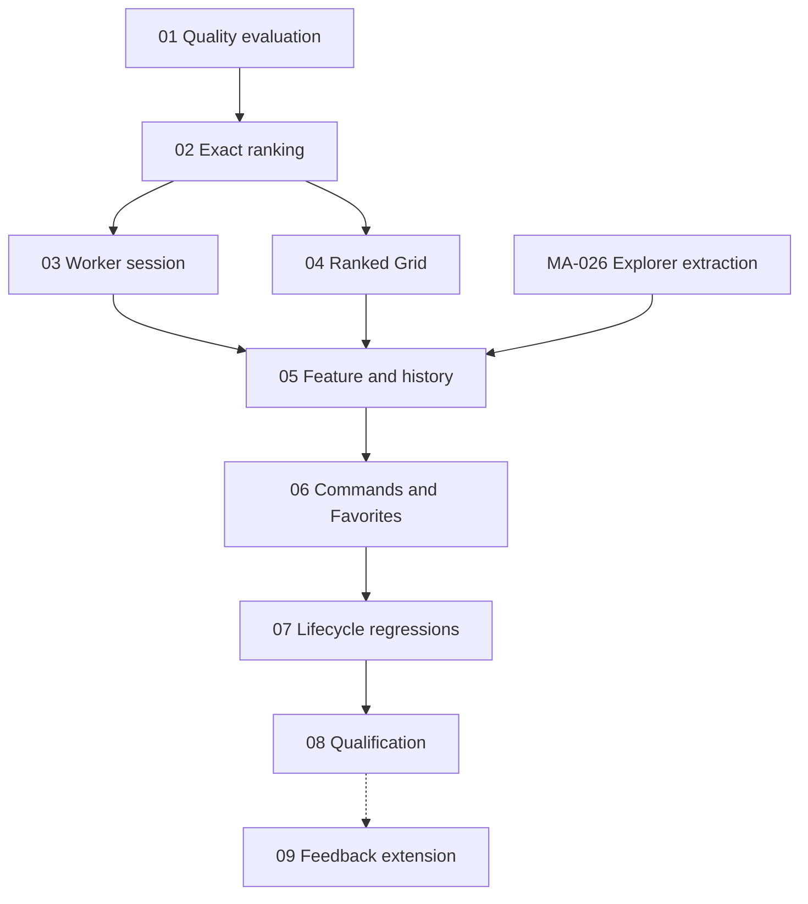

# Find more like this — tickets

Canonical scope and acceptance criteria: [feature plan](../plan.md).
Status: planning complete; all implementation work is unstarted.
Owners: T0 lead, including design, review, and fixes. No delegation is planned.

| ID | Ticket | Depends on | Status |
| --- | --- | --- | --- |
| FML-001 | [Evaluate ranking quality and resource costs](01-ranking-evaluation.md) | None | Planned |
| FML-002 | [Implement exact image ranking](02-exact-ranking.md) | FML-001 quality decision | Planned |
| FML-003 | [Add the reusable search worker session](03-search-worker.md) | FML-002 | Planned |
| FML-004 | [Add ranked Grid visits](04-ranked-grid.md) | FML-002 match contract | Planned |
| FML-005 | [Own search state and Back history](05-feature-history.md) | FML-003, FML-004, MA-026 | Planned |
| FML-006 | [Wire commands, result actions, and Favorites](06-commands-and-favorites.md) | FML-005, MA-026 | Planned |
| FML-007 | [Verify source changes and complete shutdown](07-lifecycle-regressions.md) | FML-006 | Planned |
| FML-008 | [Complete localization and native qualification](08-qualification.md) | FML-007 | Planned |
| FML-009 | [Explore positive and negative examples](09-feedback-extension.md) | FML-008; separately selected follow-up | Deferred |

[MA-026](../../../needs_refactoring.md#ma-026) is the separately planned Explorer
extraction. It is not implemented by these tickets. Its completion supplies an
owned shared-setup/analysis/browse seam; tickets 05–06 add only the search-specific
integration needed there. Reconcile final file names after that extraction.

Each ticket carries its file map, contract, acceptance criteria, commands, and
budget. Mark a ticket claimed only when implementation starts; resolve it only
with recorded evidence. Proposed test names and commands are requirements to
implement, not existing passing checks. Check that named tests actually run;
never treat an empty selection or skipped native test as proof.

The first usable integrated slice ends at FML-006. Release completion includes
07–08. FML-009 remains deferred until explicitly selected after MVP evaluation.
