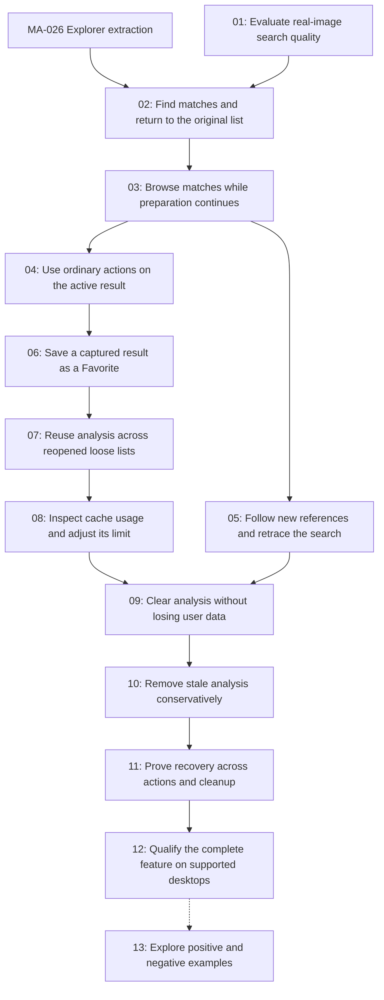

# Find more like this — proposed tickets

Status: approved for implementation by /implement use tdd and sdd, 2026-09-14.
Active: FML-001 claimed; other MVP tickets ready-for-agent subject to blockers.
Date: 2026-09-14
Canonical behavior: [specification](../spec.md).
File maps, interfaces and verification: [ticket execution map](../ticket-execution.md).
Policy summary: [implementation plan](../plan.md).

The product decisions and accepted defaults are unchanged. This proposal recuts
layer-based tasks into 12 complete MVP slices and one deferred follow-up, each
with its own demonstrable result, blocking edges and linked verification gates.
Existing FML tracking IDs are retained; numeric file prefixes now express delivery
order. MVP files are approved and marked `ready-for-agent` or claimed; none is complete.

FML-001 is the initial frontier and is now claimed. The separately tracked
[MA-026 Explorer extraction](../../../needs_refactoring.md#ma-026) is complete,
including full native CI qualification. The first usable search
arrives in FML-002. Implementation and local evaluation are authorized by `/implement`; commit
authorization remains governed by the project guide.

## Proposed breakdown

1. **[FML-001: Evaluate real-image search quality](01-ranking-evaluation.md)**
   Blocked by: None.
   Delivers: Produce a reproducible local report showing whether the existing image model finds useful content matches, with cold/warm timings and resource costs, before building the full interface.

2. **[FML-002: Find matches and return to the original list](02-first-search.md)**
   Blocked by: [FML-001](01-ranking-evaluation.md), including a recorded proceed decision. The [MA-026](../../../needs_refactoring.md#ma-026) prerequisite is complete.
   Delivers: From an image or Grid, invoke Find more like this, prepare the captured collection locally, browse one completed ranked result, and return to the original visit. This is the first usable search path; later slices extend it with live batches and reference history.

3. **[FML-003: Browse matches while preparation continues](03-progressive-search.md)**
   Blocked by: [FML-002](02-first-search.md).
   Delivers: Make the first search useful before all images are prepared: publish interactive ranked batches every 100 distinct processed sources and show continuously advancing progress above Grid.

4. **[FML-004: Use ordinary actions on the active result](04-result-actions.md)**
   Blocked by: [FML-003](03-progressive-search.md).
   Delivers: Filter a ranked result by filename and use comparison, copy, deletion, mosaics and image navigation with the files actually chosen from that result, even while rankings refresh.

5. **[FML-005: Follow new references and retrace the search](05-reference-history.md)**
   Blocked by: [FML-003](03-progressive-search.md).
   Delivers: Choose a match as the next reference, search the original collection again using prepared vectors, and use Back/Esc or Exit to recover earlier visits and the initial list.

6. **[FML-006: Save a captured result as a Favorite](06-save-result-favorites.md)**
   Blocked by: [FML-004](04-result-actions.md).
   Delivers: Save selected matches or the complete filtered result as a named Favorite, and make Add Current List capture the active ranked list during exploration.

7. **[FML-010: Reuse analysis across reopened loose lists](07-persistent-analysis-cache.md)**
   Blocked by: [FML-006](06-save-result-favorites.md).
   Delivers: Reopen an unchanged loose or overlapping list without repeating eligible inference, reuse Favorite analysis first, and control loose-list persistence from a new Cache settings tab.

8. **[FML-011: Inspect cache usage and adjust its limit](08-cache-usage-and-limit.md)**
   Blocked by: [FML-010](07-persistent-analysis-cache.md).
   Delivers: Show general, Favorite and combined analysis usage in MB in Settings Cache, and let the user persistently change the general cache limit from its initial 2 GB value.

9. **[FML-012: Clear analysis without losing user data](09-clear-analysis-cache.md)**
   Blocked by: [FML-011](08-cache-usage-and-limit.md), [FML-005](05-reference-history.md).
   Delivers: Use Clear analysis cache in Settings to remove managed general and Favorite analysis, with cancellation, accurate partial results and a usable browsing state during cleanup.

10. **[FML-013: Remove stale analysis conservatively](10-remove-stale-analysis.md)**
   Blocked by: [FML-012](09-clear-analysis-cache.md).
   Delivers: Use Remove stale records in the same Cache tab to reclaim invalid analysis while preserving records for temporarily disconnected or inaccessible sources.

11. **[FML-007: Prove recovery across actions and cleanup](11-lifecycle-regressions.md)**
   Blocked by: [FML-013](10-remove-stale-analysis.md).
   Delivers: Exercise the complete user journey through progressive search, reference history, source changes and cache cleanup, proving that stale work cannot replace the chosen visit or undo completed maintenance.

12. **[FML-008: Qualify the complete feature on supported desktops](12-qualification.md)**
   Blocked by: [FML-007](11-lifecycle-regressions.md).
   Delivers: Deliver recorded English/German, keyboard, native-session, cache and resource evidence for the complete feature, with repository checks and truthful platform limitations.

13. **[FML-009: Explore positive and negative examples](13-feedback-extension.md)**
   Blocked by: [FML-008](12-qualification.md) and separate follow-up selection/specification; deferred.
   Delivers: If separately selected after the first version is evaluated, investigate whether explicit positive/negative examples improve useful discovery without replacing the single-reference workflow.

## Blocking graph

Edges are direct prerequisites; transitive dependencies are omitted. FML-004 and
FML-005 are independent after FML-003, although their shared files require serial
implementation. Cleanup waits for reference history so retained browsing is
verified through the complete workflow. The deferred follow-up blocks no MVP work.

## Scope migration

FML-002 now includes the initial worker, ranked Grid, command and origin-return
path that previously ended only at FML-006. FML-003 extends that path with live
batches; FML-004 completes filtered-result actions; FML-005 adds reference history;
FML-006 focuses on captured Favorite saving. FML-010 adds persistent reuse with a
bounded initial store and its persistence control. FML-011 adds measured usage and
live budget editing; new FML-012 and FML-013 separately deliver full and stale-only
cleanup. FML-007/008 retain integrated recovery and final qualification. FML-009
remains a separately selected experiment.

Every slice includes its necessary lifecycle checks and translations when it
introduces behavior. FML-007 strengthens combined regressions; it does not defer
stale-result or writer safety. FML-008 completes real model/platform evidence;
future tests and native runs have not passed merely because tickets name them.

Claim only an unblocked ticket and record completion evidence before resolving it.
FML-009 remains deferred until its own scope is selected and accepted.
