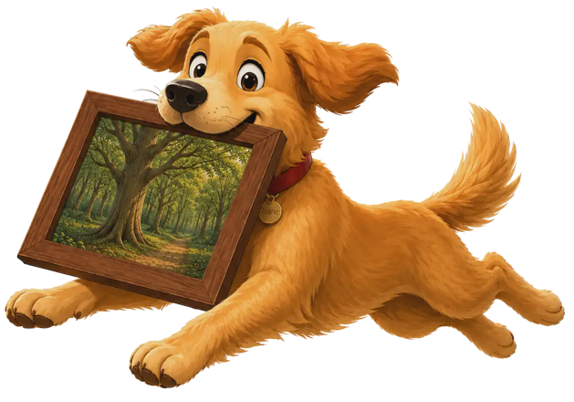
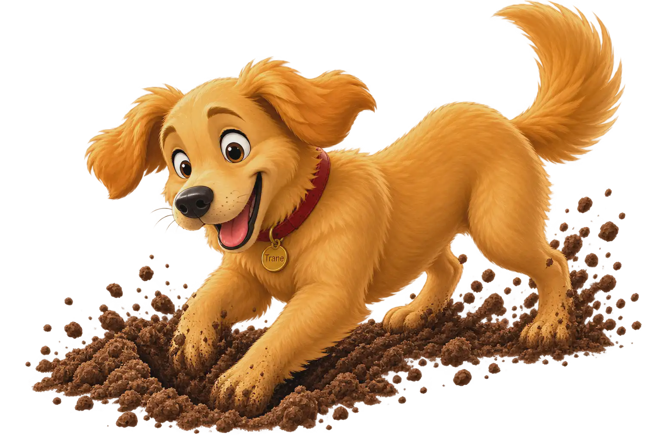

# PicFetch — User Manual

Version 0.1.3

PicFetch is a small, fast image viewer for macOS, Windows, and Linux. There
is no toolbar and no built-in file browser: you drop images onto the window
and look at them. That's the whole idea — though if you'd rather not
drag-and-drop, clicking the window or pressing `Cmd`/`Ctrl+O` brings up your
system's own file picker instead (see below).

---

## 1. Getting started

1. Start **PicFetch**. A small empty window (about 520 × 340) appears with a
   rounded border and the text **"Drop images here"**.
2. Drag one or more image files from your file manager (Finder, Explorer,
   Nautilus, …) onto the window and release.
3. The first image is displayed and the window resizes itself to fit it.

You can drop anywhere on the window — the bordered area is a visual hint, not
a target you have to hit precisely.

**No mouse handy for drag-and-drop, or just prefer a file picker?** Click
anywhere on the drop zone, or press `Cmd`/`Ctrl+O` (`Cmd`/`Ctrl+Shift+O` does
the same thing — it's a second binding for the same picker, not a different
one), to bring up your system's own file browser. On macOS and Linux it lets
you select any mix of files and folders at once, the same as a drag-and-drop;
folders are scanned the same way too (see "Scanning folders" below). **On
Windows the picker is files only** — Windows' own file dialog has no mode
that combines folder and multi-file selection — so drag-and-drop is the way
to add a folder there. This works at any time, not just on the empty drop
screen — opening more images while one is already showing replaces the
current set, or adds to it if merge mode (`M`) is on, exactly like dropping
new files would.

---

## 2. Opening this manual

You are reading it, so you have probably already found it, but for the record:

- Press **`F1`** at any time, or
- choose **Help -> Manual** from the menu.

The manual opens in its own scrollable window. A search field stays at the
top; type a term and press **Enter** to highlight matches and scroll the first
into view. Press **Enter** again with the same term to jump to the next match.
Press **`Esc`** or close the window to dismiss it; the image you were viewing
is untouched. Pressing `F1` again brings the existing manual window back to
the front instead of opening a second copy.

---

## 3. Supported file types

- **JPEG** — `.jpg`, `.jpeg`, `.jpe`, `.jfif` (EXIF rotation applied)
- **PNG** — `.png` (transparency supported)
- **GIF** — `.gif` (animated GIFs play back)
- **WebP** — `.webp` (static images)
- **BMP** — `.bmp`
- **TIFF** — `.tif`, `.tiff`
- **ICO** — `.ico` (Windows icon; the largest embedded image is shown)
- **XPM** — `.xpm` (X Pixmap)
- **HEIC/HEIF** — `.heic`, `.heif` (iPhone photos; EXIF rotation applied)
- **AVIF** — `.avif` (built-in rotation/mirroring applied)
- **SVG** — `.svg` (vector; small icons open large enough to fill the window,
  and the image re-renders sharp at every zoom level rather than scaling up).
  Re-rendering uses the screen's pixels (including Retina), not just the window
  size in points.
- **RAW** — `.cr2`, `.cr3`, `.nef`, `.nrw`, `.arw`, `.dng`, `.orf`, `.rw2`,
  `.raf`, `.pef`, `.srw`, `.raw` (the camera's embedded JPEG preview is shown,
  marked `(preview)` in the title and info overlay; there is no demosaic, and
  File -> Save Changes stays off)

A file is also accepted if your system reports it as `image/jpeg`,
`image/png`, `image/gif`, `image/webp`, `image/bmp`, `image/tiff`,
`image/x-icon`, `image/vnd.microsoft.icon`, `image/x-xpixmap`, `image/heic`,
`image/heif`, `image/avif`, `image/svg+xml`, or a camera-RAW MIME type such as
`image/x-adobe-dng` / `image/x-canon-cr2`, even when the extension is missing
or unusual.

Everything else — PDFs, videos — is **not** supported.

---

## 4. Viewing images

### Automatic window sizing

Each time an image is shown, the window resizes to match it:

- **Large images** are scaled down to fit within **1500 × 950** pixels, keeping
  the aspect ratio.
- **Small images** never shrink the window below the starting size
  (520 × 340). A tiny thumbnail is centred with empty space around it rather
  than producing a window too small to grab.
- You can always resize the window yourself afterwards by dragging its edge.
  The image is scaled to fit and is never cropped or distorted.

Settings > General has **Keep a fixed window size**. When that is on, PicFetch
stops resizing the window to fit each image (and also stops growing or
shrinking it when you zoom or rotate). Your own size is kept, including across
launches.

### The window title

The title bar tells you what you are looking at, for example:

`sunset.jpg — 4032 x 3024  (2/7)`

- **File name** of the current image
- **Pixel dimensions** of the image (after any rotation correction)
- **`(animated)`** if it is an animated GIF
- **`(preview)`** if it is a camera RAW file shown via its embedded JPEG
- **`(2/7)`** — position in the current set, shown only when you dropped more
  than one image
- **`[merge]`** at the very front, only while merge mode (`M`) is on — see
  "Browsing multiple images" below

In the grid, the title bar normally shows the file name; Show variants
(`Shift+D`) uses `(n/m) [WxH] /path` with no mode prefixes.

### Photo rotation

Photos taken with a phone or camera held sideways carry an EXIF orientation
tag. PicFetch reads that tag and rotates or flips the photo automatically,
so portrait shots appear upright instead of lying on their side. All eight
EXIF orientations are handled, and the dimensions in the title reflect the
corrected image.

If a photo still isn't the way up you want — EXIF-corrected but sideways for
some other reason, or you just want to look at it rotated — press **`R`** to
rotate it a further 90° clockwise, or **`Shift+R`** for counter-clockwise.
This is a viewing option by default: it resets back to upright with **`0`**
(along with zoom) and — like navigating to a different image — starts over at
upright on the next picture you view. To keep it, use **File -> Save
Changes** (`Cmd/Ctrl+S`) to write it back into the file, or **File -> Export
image** (`Cmd/Ctrl+E`) to write a rotated copy elsewhere in a format you
choose; see "Menu" below.
Rotating swaps the window between landscape and portrait to fit the image's
new orientation, the same as loading a different image would.

### Animated GIFs

Animated GIFs start playing as soon as they are shown:

- Frames run at the speed stored in the file.
- Frames that only update part of the picture are composited correctly, so you
  won't see leftover pixels or flickering blanks.
- Frames with no delay (or a zero delay) are shown for 0.1 s so playback stays
  watchable.
- The animation loops until you navigate away or drop new files, at which
  point it stops on its own.

---

## 5. Zoom and pan

By default an image is always scaled to **fit the window**, exactly as
described above. Four keys switch to a manual zoom level:

- **`+`** — zoom in
- **`-`** — zoom out
- **`1`** — jump straight to **100%** (one image pixel per screen pixel)
- **`0`** — back to fit-to-window

The first `+` or `-` press zooms in or out from whatever fit is currently
showing, rather than jumping to 100% first, so zooming feels continuous.
Repeated presses keep scaling up or down, clamped between 5% and 1600%.
The window grows and shrinks with the image as you zoom: never smaller than
the size PicFetch opens at, and never larger than the maximum window width
and height in **File -> Settings…**. `0` restores both fit-to-window and that
default image-fit window size.

**Scrolling** the mouse wheel or trackpad over the image zooms too, and
unlike the keyboard shortcuts it zooms around the point under your cursor
rather than the image centre, so whatever you're pointed at stays put on
screen as you zoom in or out.

Once the image is zoomed in far enough that it no longer fits in the
window (the window is already at its maximum size), the cursor changes to a
hand over it to show it can be dragged;
**click and drag** to pan around it — the drag is clamped so you can't
pull the image away from the window and leave empty space behind it.
While fitted to the window, or zoomed to a level that still fits inside
it, panning does nothing and the cursor stays the plain arrow.

Holding **Shift** while scrolling pans instead of zooming, in whichever
direction you scroll — handy for a trackpad two-finger swipe once you're
zoomed in, without having to click and drag.

Zoom and pan are per-image: navigating to another picture (with the arrow
keys, `Home`/`End`, or a fresh drop) always starts that image back at
fit-to-window. View rotation (see "Photo rotation" above) resets the same
way, and rotating also resets zoom back to fit — a manual zoom level chosen
before the turn rarely still makes sense once the image's landscape/portrait
axes have swapped.

---

## 6. Info overlay

Press **`I`** to show a small card in the top-left corner of the window with
everything about the current image at a glance:

- the **file name**, and its position in the set (e.g. `3 / 47`) if you
  dropped more than one image
- its **pixel dimensions** (e.g. `1920 x 1080`)
- its **file size** on disk
- the current **zoom level**, as a percentage

It updates live as you navigate or change zoom, and — unlike a toast message
— stays up on screen until you press `I` again to turn it off. It's a
standing preference like sort order or merge mode: once on, it stays on
across navigation and further drops, reappearing as soon as the next image
loads even if you briefly return to the empty drop screen in between.

Below that summary, a **"Show EXIF data"** link opens a separate window with
the current image's Exif metadata — camera make and model, lens, exposure
time, aperture, ISO, focal length, capture date, and — for a photo that was
geotagged — its **latitude** and **longitude** in decimal degrees, one line
per tag that's actually present in the file. `E` opens the same window
directly, without
needing the info overlay open first. The window updates if you navigate to a
different image while it's still open (from the image window, or with `Left`/`Right`
while the EXIF window itself is focused), and — like the manual and About
windows — `Esc` closes just that window, and pressing `E` again while it's
already open brings it back to the front instead of opening a second copy.
Files with no Exif data (most PNGs, GIFs, and WebPs, and any JPEG without a
camera-written Exif segment) show a "no metadata found" message instead of
an empty window.

Below the tag list, JPEGs get a **Remove Metadata** button (above the map,
when there is one). It asks for confirmation (**Cancel** selected by
default; **`Left`**/**`Right`** and **`Return`** / **`Esc`**, same keyboard rules as
other PicFetch confirmations). It rewrites the **original JPEG** in place.
The button is hidden for a JPEG with nothing left to remove, including after
a successful strip, and whenever the panel shows "no metadata found". Identifying
bytes that are not listed (comments, XMP, IPTC, a second picture after the
image) are still dropped if you strip a file that *does* list tags.

The button itself is a compact control, not a full-width
bar.

- JPEG only. HEIC, RAW, PNG, WebP: the button is hidden.
- Removes camera, date, GPS, XMP, IPTC, and comments. Color profile (ICC) and
  the JPEG's own color transform stay, so the picture should look the same.
- A photo shot sideways (Exif orientation 2–8) is re-saved once so it stays
  upright without the orientation tag; that is a normal JPEG re-encode (quality
  95), not a lossless copy. The original ICC profile is copied onto that
  re-encode.
- A photo already upright is stripped without re-encoding the pixels.
- View-only rotation (`R`) is not written; use **File -> Save Changes** first
  if that rotation should land on disk.
- A second JPEG or motion-photo video appended after the main image is
  discarded, so tags hidden in that extra copy are removed too. The still
  stays; the extra frame or video does not.
- Cannot be undone except from backups / Trash — this is not a Trash move.

Below the tag list, a photo that carries GPS coordinates gets a collapsible
**Location** section: expand it and a map centred on the spot the photo was
taken appears, with a pin marking it. It starts collapsed every time the
window opens, and it is only while it is expanded that PicFetch fetches map
tiles — so opening the EXIF window never puts your photo's location on the
network by itself.

The first expand shows **"Loading map…"** while the tiles around the
location download; the map appears complete once they are in, and the
window stays responsive throughout. Panning or zooming beyond what was
downloaded fills in as the new tiles arrive, again without blocking
anything. The map takes whatever height the window leaves it, so drag the
EXIF window taller to get a bigger map. The map is drawn from
[OpenStreetMap](https://openstreetmap.org) tiles (© OpenStreetMap
contributors); the section is absent entirely for the great majority of
files, which carry no GPS tags at all.

---

## 7. Browsing multiple images

Drop several files at once and step through them with the keyboard:

- **`Right`** or **`Down`** — next image
- **`Left`** or **`Up`** — previous image
- **`Home`** — jump to the first image
- **`End`** — jump to the last image

Navigation **wraps around**: pressing `Right` on the last image returns to the
first, and `Left` on the first goes to the last.

While the **EXIF data window** is focused, `Left` and `Right` do the same next/previous
step (including wrap-around). `Esc` still closes only that window. While
**Remove Metadata** is asking for confirmation, `Left`/`Right` move the confirmation
choice, not the image.

Notes:

- The arrow keys walk the current set and wrap around. If you opened
  **one image file** (a drop, the file picker, or `picfetch photo.jpg`),
  PicFetch also loads the other images in that file's folder — not
  subfolders — and parks on the file you opened, so Left/Right move to
  its neighbors. Opening two or more files keeps exactly that subset.
  Opening a folder still scans it recursively (see "Scanning folders").
  A folder that contains only that one image still has nothing to step
  to. While hide-duplicates is on (`D`, see "Grid overview"), arrows
  skip hidden extras and wrap among the remaining files; `Home`/`End`
  jump to the first and last remaining file.
- By default the set is **naturally sorted** by file name, so `IMG_2.jpg`
  comes before `IMG_10.jpg` even though a plain text sort would put them the
  other way round. Press **`S`** to cycle through four more orderings, and
  back to name:
  - **Capture date** — the photo's Exif date/time (the same value the Exif
    window shows as "Date taken"); a file with no Exif capture date - a
    screenshot, most PNGs/GIFs/WebPs, or a JPEG a camera never tagged -
    falls back to its filesystem modification time instead of clumping at
    the very start of the list.
  - **Modified** — filesystem modification time.
  - **Size** — file size, smallest first.
  - **Unsorted** — the raw order the files were handed over by your file
    manager ("stupid sort" — no sorting at all).

  The title bar shows which mode is active (`[sort: date]`,
  `[sort: modified]`, `[sort: size]`, `[unsorted]`) - nothing is shown for
  the default name sort. The image you're currently looking at stays on
  screen across every switch. Sorting never removes duplicate files, and the
  preference carries over to the next drop, and across restarts, until you
  change it again.

  Capture date, modified, and size all have to read every file once to sort
  by it - a stat for modified/size, a raw file read for capture date -
  which can pause noticeably on a very large recursive drop, with no
  progress indicator or way to cancel it once started.
- Dropping new files **replaces** the current set and starts again at the
  first image just dropped, unless **merge mode** is on. Press **`M`** to
  turn merge mode on or off; while it's on, the title bar starts with
  **`[merge]`** so you can always tell which mode you're in. With merge
  mode on, a new drop **adds** its files to the current set instead of
  replacing it — display jumps to the first file just added, sorting still
  applies, and nothing is deduplicated, so dropping the same file twice
  adds it twice. If a merge-mode drop contains nothing supported, the
  existing set is left exactly as it was and you just get an error toast,
  not a wipe. Merge mode is a standing preference, like sort order — it
  stays on (or off) across drops until you press `M` again, so you don't
  have to hold anything down mid-drag.

---

## 8. Grid overview

Press **`G`** to switch to a full-window grid of thumbnails for the current
set — handy for finding one particular image in a large drop by sight
instead of arrowing through them one at a time.

- Click any thumbnail to jump straight to it and return to the normal view,
  or use the keyboard: the arrow keys move a highlighted ring around the
  grid (starting on whichever image was on screen when you opened it),
  **`Page Up`**/**`Page Down`** jump it a full screen of rows at a time —
  handy for covering a lot of ground fast, and clamped so it stops dead at
  the first or last image — and **`Return`** opens whichever thumbnail is
  currently highlighted.
- Press **`G`** again, or **`Esc`**, to leave the grid without picking
  anything. Closing the grid does **not** turn hide-duplicates off (see
  `D` below).
- Press **`/`** to search by file name: a bar appears across the top, and
  what you type filters the grid down to the names containing it as you go.
  Matching ignores upper and lower case, and the bar keeps a count of how
  much of the set is left (`3 of 847`). Backspace deletes a character, the
  arrow keys, `Page Up`/`Page Down` and `Return` work on the matches
  exactly as they do on the full grid, and **`Esc`** clears the search so
  every remaining image is shown again.
- Press **`D`** to hide extra copies of the same shot. The full file set
  stays loaded; uniques always stay visible, and each group of near-matches
  keeps one representative (the highest-resolution file: most pixels after EXIF orientation; equal sizes keep the earliest file in the current order). The
  other members of the group disappear from the grid, and remaining cells
  that stand for two or more files show a small count badge. `D` does
  **not** switch to a duplicates-only gallery. Press **`D`** again to show
  every thumbnail. How close two thumbnails have to be to count as the same
  shot is the **Duplicate match distance** slider in **File -> Settings…**
  (0–32, default 6; lower is stricter, and 0 is an exact thumbnail hash).
  Two files count as copies of the same shot only when every pair in the
  group is close enough — matching the first file is not enough if the
  others do not also match each other. A chain of similar-looking photos
  does not merge into one giant group. Solid-color images (no detail for
  the matcher) are not grouped as duplicates.
  Re-saved, re-exported and downscaled copies of one picture match
  comfortably at the default; raising the slider much above it starts
  pulling in genuinely different pictures rather than finding more copies.
  Cropped versions of a picture are not detected at any setting — cropping
  moves everything in the frame, which is exactly what the matcher looks at.
  Changing the slider while extras are hidden regroups the grid immediately.
  `/` search and hide-duplicates stack: a name filter while extras are
  hidden shows only remaining cells whose names match. While a search is
  open, `d`/`D` is a letter in the query, not the hide toggle.
- Press **`Shift+D`** to show every copy of the **highlighted** shot (in the
  grid) or the **current** shot (in image view). The grid lists only that
  group, including extras `D` would hide.
- While that variants grid is showing, the duplicate-count badges are hidden
  (every cell is already a member of the same group).
- The window title names the highlighted thumbnail as
  `(position) [widthxheight] full-path`, for example
  `(2/7) [1440x780] /photos/vacation/IMG_0123.jpg`. `[merge]`, sort-order,
  and `[shuffle]` prefixes are hidden while variants are showing. Arrow keys
  and hovering the pointer over a thumbnail both move the highlight, so both
  update the title. Leaving variants restores the usual file-name title and
  those prefixes.
- If thumbnails are still being hashed, an info toast says **The images are
  currently being analyzed**; the group appears when hashing finishes. A
  unique shot (already hashed, no copies) does nothing.
- **`Esc`** leaves browse before it turns hide off. **`G`**/Close leave hide
  on but **end** browse.
- Committing a variant (`Return` or a click) shows **that** file, even when
  hide-duplicates would otherwise keep the highest-resolution copy on screen.
  Left/Right then loop only the group; Home/End still jump to the first/last
  visible file of the whole set, and Left/Right after that still loop the
  group. `Esc` or `G` from that view reopens the
  variants grid; `Esc` again returns to the hide-duplicates grid. `D` and `P`
  do nothing while variants are showing or that loop is active.
- While `/` search is open, **`Shift+D`** is not browse (`D` is a letter).
- In picture-frame mode, **`Shift+D`** does nothing, like **`G`**.
- **Select several at once** to act on them together:
  **`Cmd/Ctrl+click`** a thumbnail to add it to the selection (or click it
  again to take it back out), **`Shift+click`** to select everything
  between it and the last one you clicked, **`Space`** to pick whichever
  thumbnail is highlighted, and **`Cmd/Ctrl+A`** to select the lot.
  Drag a rectangle across the thumbnails to select everything it touches; hold Shift or Cmd/Ctrl while dragging to add to what was already picked.
  Selected thumbnails are washed in the accent colour, and the top bar
  counts them (`12 selected`). A click without dragging still just opens an image.
- With exactly two files selected, press **`Cmd/Ctrl+D`** or choose
  **Actions -> Compare selected images**. On macOS, `Cmd+D` is the native
  shortcut; physical **`Ctrl+D`** also works on macOS. An opaque comparison opens in the
  same window with both images fitted into fixed 50/50 panes; the file earlier
  in the current grid order is on the left. Each side shows its own spinner
  while loading. Translucent bottom-corner badges identify the files by base
  name; if those names match, both expand to the shortest distinguishing
  folder/file suffix. The window title follows the same order, for example
  `Compare: left.jpg | right.jpg - PicFetch`. A separate translucent card holds
  the top-left **Unlink** button; it and physical **`Ctrl+L`** remain inactive
  until both images are ready. A translucent action toolbar stays at the top
  right: **Back to Grid** remains available while loading, and
  **Swap** becomes available once both images are ready. Swap exchanges the
  images, badges, and title without loading either file again. **Swipe**
  switches both images to the full comparison viewport and adds a vertical
  divider. It becomes available only once both images are ready. Drag the
  divider to change the reveal; dragging elsewhere continues to pan both
  images. While swipe is active, **`Left`** / **`Right`** move the divider by
  5 percentage points, **`Shift+Left`** / **`Shift+Right`** by 1 point, and
  **`Home`** / **`End`** move it to 0%/100%.
  **Side by side** returns to fixed 50/50 panes. Switching layouts preserves
  each photo's position and size, the camera, and the divider position; a new
  comparison starts side by side at 50%. During normal linked use, zoom and pan operate
  one overhead camera above the two photos. Scroll over either pane or use
  **`+`** / **`-`** to zoom that camera; dragging either comparison pane or
  using Shift+scroll moves both views by the same screen distance. Camera
  movement stops before either photo can pass completely beyond the centre of
  its pane. **`0`** frames both photos in their current arrangement with one
  camera move while retaining their relative sizes and offsets. **`1`** returns the camera to
  its 1x home view relative to the stored arrangement; after the photos have
  been resized separately, it does not make both of them decoded-pixel 100%.
  Use the top-left **Unlink** button or press physical **`Ctrl+L`** (`Ctrl`,
  including on macOS; not `Cmd`) to toggle the panes between linked and
  unlinked views. The first click or press unlinks them until either control is
  used again; releasing Control has no effect. Once unlinked, the button
  changes to **Link**, and the status **Unlinked** appears immediately beside
  it, followed by **Left** or **Right** once a pane has been targeted. Drag,
  scroll, or Shift+scroll then changes only the pane under the pointer;
  unmodified **`0`**, **`1`**, **`+`**, and **`-`** change the
  hovered or last-hovered photo and do nothing until a pane has been targeted.
  Here **`0`** fits and centres only that photo in the current camera view, and
  **`1`** shows only that photo at decoded-pixel 100%. A photo may be moved
  until one of its edges reaches the pane centre. Changing the link state never
  moves or resizes either photo: pressing **`Ctrl+L`** again locks the current
  arrangement, and later linked controls move only the camera. Window resizing
  and layout changes preserve the photo arrangement and camera. Swap locks and
  clears any divergence from the last-targeted side before exchanging the images. A
  new comparison always starts linked.
  Raster sources stay at full decoded resolution and use their canonical
  EXIF-corrected orientation; a temporary rotation in the single-image viewer
  is not carried into comparison. SVGs re-render at their effective
  screen-pixel size whenever zoom, layout, or window size changes. RAW files
  use the same embedded JPEG preview as the normal viewer. Animated inputs stay
  frozen on their first decoded frame for the entire comparison session.
  A bounded overview remains visible while sharper detail tiles arrive in the background.
  Pan and zoom update that stable GPU surface directly, so interaction does not
  wait for the sharper tiles.
  Full fidelity can require the combined decoded memory of both sources even
  when the image cache retains only one. The existing encoded-input and
  vector-raster limits still apply. If either source cannot complete, PicFetch
  reports the load failure and returns to the unchanged grid; the panes are
  never downsampled or removed to make the comparison fit a limit.
  **Back to Grid** or **`Esc`** returns to the unchanged grid, including
  selections that a filename or duplicate filter currently hides.
- Comparison is an exclusive main-window mode. Until you return to Grid View,
  PicFetch disables or ignores ordinary viewer, grid, file, Favorites, and
  Actions commands; typed keys and pointer gestures do not reach the covered
  surfaces. The comparison toolbar, **`Esc`**, **`F1`** help, and normal window
  closing remain available. Attempts to open files through the file dialog, a
  drop, or the operating system's Open With delivery are discarded and show
  **Return to Grid View before opening files**.
- With a selection made, **`Shift+Delete`** moves all of it to the Trash
  (after the usual confirmation, which names the count rather than every
  file), and **`Cmd/Ctrl+C`** copies the files themselves to the clipboard
  — paste in Finder, Explorer or your file manager to get copies of them.
  Both work on the highlighted thumbnail alone if you haven't selected
  anything, and the grid stays open afterwards so you keep your place.
- Because the selection is a set of *files*, narrowing with `/` and then
  pressing `Cmd/Ctrl+A` selects exactly the matches — `/holiday`,
  `Cmd/Ctrl+A`, `Shift+Delete` clears every holiday photo out of a folder
  of thousands. Clearing the search afterwards leaves the selection intact.
- **`Esc`** undoes one thing at a time: an in-progress drag first, then the
  selection, then the search, then browse-duplicates, then hide-duplicates,
  then the grid itself. `G` closes the grid
  as usual, but goes quiet while a selection or a search is still up, so it
  can't throw away work in progress. `G` and Close leave hide-duplicates
  on: the single-image view still skips hidden extras until you press `D`
  again (or `Esc` through that stage while the grid is up).
- Apart from those, every other key is ignored while the grid is up - zoom,
  `S`/`M`/`P`/`I` all do nothing until you either pick a thumbnail (click
  or `Return`) or back out with `G`/`Esc`. `D` and `Shift+D` are the
  exceptions (unless a search is open); `Cmd/Ctrl+D` also opens comparison
  when exactly two files are selected. While a search is open, the letter
  keys are characters you are typing, so `G` no longer closes the grid and
  `D`/`Shift+D` no longer toggle hide-duplicates or browse - `Esc` does.
- The search only narrows what the grid shows. It changes nothing about the
  set itself: pick an image and the arrow keys still walk through every
  file you dropped, and the next time you open the grid it starts
  unfiltered, with nothing selected. Hide-duplicates is different: it
  stays on after you leave the grid, and arrows, `Home`/`End`, and
  picture-frame advance skip the hidden extras until you turn it off.
- Thumbnails are generated in the background as they scroll into view, a
  few at a time, so opening the grid on a folder with thousands of images
  doesn't stall the window waiting for all of them to decode up front.
- The grid needs at least one image loaded, and doesn't combine with
  picture-frame mode - opening one closes the other.

### Image mosaics

While the Grid is open, choose **Actions -> Generate Image Mosaic...**. If
you explicitly selected thumbnails, only those files become the source pool;
otherwise PicFetch snapshots every image in the current filtered Grid result.
Later selection, filtering, navigation, renaming, or deletion does not retarget
an already-open mosaic window, and generation never modifies a source file.

Choose the target display by its name, native pixel resolution, and aspect
ratio. **Refresh Displays** updates that list; if the chosen display has been
removed, PicFetch requires a new selection. **Advanced** reveals minimum image
size, frame, size variation, overlap, maximum rotation, and the drop-shadow
option; the target display is the only visual setting shown while Advanced is
collapsed. Generate runs in the background. `Esc` cancels an active generation
and a second `Esc` closes the window; when idle, `Esc` closes it directly. All
controls and actions are reachable with `Tab` and `Shift+Tab`, and `Enter` or
`Space` activates a focused button.

After generation, **Start Over** returns to configuration, discards the current
preview and status, and keeps the sources, selected display, visual settings,
and export format so you can choose another display and generate its wallpaper.
**Regenerate** keeps the same sources, display, and settings but makes a new
arrangement. **Save Image** exports the exact full-resolution result as PNG or
JPEG. **Set as Wallpaper** uses a PicFetch-owned persistent copy: on Windows and
macOS it changes only the chosen display, while the ordinary main-window
wallpaper command remains global/all-screen. Linux's available GNOME/KDE
integrations are global-only, so a targeted mosaic request is refused before
any desktop change; **Save Image** remains available.

---

## 9. Picture-frame mode

Press **`P`** to turn the current image set into a full-screen slideshow —
handy for letting PicFetch just sit there and cycle through a folder of
photos like a digital picture frame.

- The window goes **full-screen**. The image is scaled to fit the screen,
  keeping its aspect ratio — never stretched or cropped, the same
  scale-to-fit behavior as the normal window.
- Every **10 seconds** (by default) the view **automatically advances** to
  the next image, wrapping around at the end just like manual navigation.
  Each transition **crossfades** — the outgoing image fades to nothing, the
  incoming one fades in — instead of the instant swap ordinary browsing
  uses. Manual navigation (`Left`/`Right`/`Home`/`End`) crossfades the same way
  while picture-frame mode is on. If hide-duplicates is on, auto-advance
  and those keys skip hidden extras the same way ordinary browsing does.
- **`Up`** increases the interval by one second, **`Down`** decreases it (down to
  a floor of one second). While picture-frame mode is on, `Up`/`Down` control the
  timer instead of navigating — use **`Left`**/**`Right`** (or `Home`/`End`) to
  navigate manually, which still works as usual and restarts the countdown
  from the new image.
- **`Shift+P`** turns **shuffle** on or off: with it on, auto-advance picks a
  random other image each time instead of the next one in order (never the
  one already on screen), and the title bar starts with **`[shuffle]`**.
  Manual navigation with `Left`/`Right`/`Home`/`End` is unaffected either way — it
  always steps through the set in order. Shuffle works as a standing
  preference like merge mode: `Shift+P` works even before you ever turn
  picture-frame mode on, and outside it too.
- **Animated GIFs are always let finish.** If a GIF's full loop takes longer
  than the current interval, picture-frame mode waits for it to play through
  at least once before moving on, rather than cutting it off partway.
- Your chosen interval and shuffle setting are remembered the next time you
  turn picture-frame mode on — and carry over the next time you launch
  PicFetch, too.
- Press **`P`** again, or **`Esc`**, to leave picture-frame mode and return to
  the normal window. `Esc` only leaves picture-frame mode here — it doesn't
  also clear the loaded images; press it again afterwards for that.
- Picture-frame mode needs at least one image loaded — pressing `P` on the
  empty drop screen does nothing.

---

## 10. Deleting a file

Press **`Shift+Delete`** to move the file currently on screen to the OS
trash/recycle bin. A confirmation card appears with two buttons:

- **Cancel** — selected by default
- **Move to Trash** (in red)

Whichever button is currently selected is outlined, so what `Return` will
press is always visible before you press it.

You can respond either way:

- **With the mouse**: click either button directly.
- **With the keyboard**: press **`Right`** to move the selection onto
  "Move to Trash" (**`Left`** moves it back to Cancel) — the outline moves
  with it — then **`Return`** to go with whichever one is currently
  selected. **`Esc`** cancels immediately from either selection.

While the card is up, every other key is ignored — navigation, zoom, `S`/`M`/
`P`/`I`/`G` all do nothing until you respond to the prompt one way or the
other.

Deleting the current file removes it from the set and shows whatever now
takes its place, wrapping around the same way normal navigation does; if it
was the only file left, you're returned to the empty drop screen. If the
file turns out to already be gone, or can't be deleted for some other reason
(permissions, for example), a toast explains what went wrong and the file
stays in the set.

Pressed while the grid overview is showing, `Shift+Delete` asks about
everything selected there instead (see above). The card appears over the
grid, and the grid stays open once you've answered. Anything the system
refuses to move stays both on disk and in the set, and the toast says how
many of them actually went.

---

## 11. Keyboard shortcuts

- **`F1`** — open this manual
- **`Cmd`/`Ctrl+O`** / **`Cmd`/`Ctrl+Shift+O`** — open the system file picker
  (same as clicking the drop zone; both bindings do the same thing; files and
  folders on macOS/Linux, files only on Windows — see above)
- **`Cmd`/`Ctrl+1`** through **`Cmd`/`Ctrl+9`** — open sorted favorites 1
  through 9; **`Cmd`/`Ctrl+0`** opens favorite 10 (see "Menu" below)
- **`Cmd`/`Ctrl+Shift+F`** — open **Manage Favorites…**, fully keyboard-driven
  (the removal confirmation included): arrow keys move a ring over each
  favorite and over its `Open`/`Remove` buttons, `Return` activates whichever
  is ringed, `Esc` closes (see "Menu" below)
- **`Opt`/`Alt+Shift+F`** — open **Add Current List to Favorites…** (greyed
  out, and this shortcut does nothing, when no files are loaded; see "Menu"
  below)
- **`Right`** / **`Down`** — next image
- **`Left`** / **`Up`** — previous image
- **`Home`** / **`End`** — first / last image
- **`S`** — cycle sort order: name -> capture date -> modified -> size ->
  unsorted -> back to name
- **`M`** — toggle merge mode (next drop adds to the set instead of
  replacing it); shown in the title bar as a **`[merge]`** prefix
- **`G`** — toggle the grid overview (see above); arrow keys move the
  highlight and `Page Up`/`Page Down` move it a page at a time, `Return` or
  a click opens it, `G`/`Esc` backs out. `G` does not turn hide-duplicates
  off
- **`V`** — return to the normal image view (closes the grid or leaves
  picture-frame mode). Not a toggle. While a grid search is open, types
  the letter `v` instead
- **`D`** — hide extra copies of the same shot (see "Grid overview");
  remaining cells show a count badge. While a grid search is open, types
  the letter `d` instead
- **`Shift+D`** — show every copy of the highlighted/current shot (see
  "Grid overview"); while a grid search is open, types the letter `D`
  instead
- **`/`** — (grid only) search the grid by file name; stacks with
  hide-duplicates. `Esc` clears the search, then browse-duplicates, then
  hide-duplicates, then leaves the grid
- **`Space`** — (grid only) add the highlighted thumbnail to the selection,
  or take it back out
- **`Cmd`/`Ctrl+A`** — (grid only) select every thumbnail the grid is
  currently showing (just the matches, while a search narrows it)
- **`Cmd`/`Ctrl+click`** / **`Shift+click`** / **click-and-drag** — (grid only) add one thumbnail / select the range / select every thumbnail the rectangle touches (Shift or Cmd/Ctrl+drag adds rather than replacing)
- **`+`** / **`-`** — zoom in / out (the window scales with the image, within
  the open-size minimum and the Settings maximum)
- **`1`** — zoom to 100%; **`0`** — back to fit-to-window and the default
  image-fit window size (and un-rotates, see below)
- scroll (mouse wheel or trackpad) — zoom in/out, anchored at the cursor
- **Shift** + scroll — pan instead of zoom
- click and drag — pan around a zoomed-in image
- **`R`** / **`Shift+R`** — rotate the displayed image 90° clockwise /
  counter-clockwise (view-only; resets on `0` or the next image)
- **`I`** — toggle the info overlay (file name, position, dimensions, file
  size, zoom level)
- **`E`** — open the EXIF data window for the current image (camera
  make/model, lens, exposure, aperture, ISO, focal length, capture date,
  coordinates);
  also reachable via the **"Show EXIF data"** link in the info overlay.
  While that window is focused, Left/Right change image.
- **`Cmd`/`Ctrl+E`** — export the current image to a new file: a prompt asks
  which format (**`Left`**/**`Right`** to choose between PNG and JPEG, **`Return`**
  to export, **`Esc`** to cancel), then you name the file in the system save
  panel (see "Menu" below). **`Up`** and **`Down`** move between the format
  buttons and the prompt's two options above them, and only the row you are
  on is highlighted brightly — an export size limit (**`Left`**/**`Right`**
  to pick one) and **Include camera metadata** (**`Space`** or **`Return`**
  to tick or untick it). **`Return`** exports from anywhere else in the
  prompt, and **`Esc`** cancels from anywhere. Plain `E` above still opens
  the EXIF window — only the modified combination exports
- **`Cmd`/`Ctrl+Shift+E`** — make the current image the desktop wallpaper
  (see "Menu" below)
- **`Cmd`/`Ctrl+C`** — copy the current image to the system clipboard, as
  image data you can paste into another app (not a file). In the grid
  overview it copies the selected *files* instead, so a paste in your file
  manager creates copies of them
- **`Opt`/`Alt+Shift+C`** — Copy Selection mode in the normal image view.
  Drag a rectangle on the image (it stays inside the picture). Drag inside
  the rectangle to move it, or drag a handle to resize it. **Copy to
  clipboard** (or `Return`/`Enter`) copies that image-region at the image's
  own resolution as PNG, with none of the window UI in the result. `Esc`
  leaves the mode without changing the clipboard. Zoom and pan still work.
  Unavailable while the grid or picture-frame mode is up, while a prompt
  owns the window, or when no decoded image is showing
- **`Cmd`/`Ctrl+Shift+C`** — copy the current image's file path to the
  clipboard
- **`Cmd`/`Ctrl+R`** — show the current file in your file manager, selected
  in its own folder (see "Menu" below). Plain `R` still rotates the image
- **`Shift+Delete`** — move the current file to the Trash, after confirming
  (see "Deleting a file" above); in the grid overview, everything selected
  there
- **`P`** — toggle picture-frame mode (full-screen slideshow with a
  crossfade between images, see above)
- **`Shift+P`** — toggle shuffle order for picture-frame mode's
  auto-advance; shown in the title bar as a **`[shuffle]`** prefix
- **`Up`** / **`Down`** *(while in picture-frame mode)* — increase / decrease the
  auto-advance interval by one second
- **`Esc`** — clear the current images and return to the initial drop screen;
  quits the app if there's nothing loaded to clear (in the manual window it
  only closes the manual; in picture-frame mode it leaves picture-frame mode
  first); while a scan is still running (a folder drop, or a single-file
  open listing that file's folder), it cancels the scan instead
  (see "Scanning folders" below)

**Linux clipboard support.** Copying the image itself (`Ctrl+C`) shells out to
an external tool, since Linux has no single built-in way to put image data on
the clipboard: `xclip`, or `wl-copy` (from the `wl-clipboard` package) as a
fallback for a Wayland session with no XWayland. Most distros don't install
either by default — add one with your package manager, e.g.
`sudo apt install xclip` or `sudo apt install wl-clipboard` on Debian/Ubuntu.
Without one, `Ctrl+C` shows an error toast instead of copying. Copying the
file path (`Ctrl+Shift+C`) is plain text and always works, no extra tool
needed. macOS and Windows need nothing extra either way.

**Linux file-manager support.** "Reveal in file manager" (`Ctrl+R`) asks your
file manager over D-Bus to open the folder with the file already selected,
which Nautilus, Dolphin, Nemo, Thunar and PCManFM all answer. On a desktop
with no such file manager it falls back to `xdg-open` on the folder, which
opens it without selecting anything. If neither is available you get an error
toast. macOS (Finder) and Windows (Explorer) always select the file itself.

---

## 12. Menu

- **File -> Open Files…** — opens the system file browser, same as
  `Cmd/Ctrl+O`
- **File -> Save Changes** (`Cmd/Ctrl+S`) — writes a rotation you made with
  `R`/`Shift+R` back into the file it came from, in that file's own format.
  Greyed out unless there is a rotation to save; unavailable for animations
  and for formats PicFetch can read but not write (WebP, HEIC, ICO, XPM, SVG).
  This replaces the original file and re-encodes it. For JPEG, PicFetch
  copies the original metadata (EXIF, including camera/date/GPS, plus
  XMP, ICC, and IPTC if present) into the new file and sets the
  orientation tag to 1, because the pixels already include both the
  camera's orientation and the rotation you just saved. A JPEG thumbnail
  stored in EXIF is dropped so it cannot show the unrotated photo
- **File -> Export image** (`Cmd/Ctrl+E`) — asks which format to export to
  with a keyboard-enabled prompt, the same shape as the delete confirmation
  card: **`Left`**/**`Right`** to choose between **PNG** (selected by default) and
  **JPEG**, **`Return`** to export, **`Esc`** to cancel without opening a
  save panel at all. The chosen format then saves the image as it currently
  appears, rotation included, to a new file you name. Unlike Save Changes it
  works for every image the app can display, including WebP and HEIC files
  and a single frame of an animated GIF, and it never touches the original.
  If the name you type already ends in a format PicFetch can write, that
  format wins over the one you chose in the prompt
- **The export prompt's two options** — both start at the behaviour above
  every time the prompt opens, and neither is remembered afterwards:
  - **Export size limit** — **Original**, **2400 px**, **1600 px** or
    **1000 px**, applied to the image's longest edge with the proportions
    kept. A photo already smaller than the limit you pick is exported at its
    own size; nothing is ever enlarged. The **Original** entry states the
    picture's real longest edge, so you can see at a glance whether a
    smaller limit would change anything — for a camera RAW that is the size
    of the preview stored inside it, which is what the app displays. When a
    limit actually applies, the save panel opens with the size in the
    suggested file name (`holiday-1600.jpg`), so a smaller copy does not
    collide with the picture it came from
  - **Include camera metadata (JPEG only)** — ticked by default, which
    copies the source JPEG's metadata into the exported file exactly as
    Save Changes does. Untick it to write the copy without the camera,
    capture-date and GPS tags — your own file keeps all of them, since an
    export only ever writes the new copy. The embedded colour profile is
    kept either way, so colours do not shift for whoever receives it. PNG
    files carry no metadata in either case, which is why the option names
    JPEG. If you want the tags gone from the *original* rather than from a
    copy, that is **Remove Metadata** in the EXIF window, which rewrites the
    file itself and cannot be undone
  - A JPEG exported from another format, or any PNG export, has no metadata
    to begin with. A JPEG exported with metadata *and* a size limit that
    changed the pixels keeps everything except the handful of tags that
    recorded the old width and height, which are dropped rather than left
    stating a size the file no longer has
- **File -> Close Files** — returns to the drop zone without quitting
- **File -> Settings…** — opens the settings window, including the
  **Duplicate match distance** slider (0–32, default 6; lower is
  stricter, 0 is an exact thumbnail hash) that hide-duplicates (`D`) uses,
  and the **Cache favorite previews on disk** checkbox (on by default) for
  the background favorite-preview generation described below. The **Limits**
  tab contains **Max files per folder scan**, **Max image cache (MB)**,
  **Max thumbnail cache (MB)**, and **Max file size (MB)**. **Check for
  updates** (off by default) is under Updates. When enabled, PicFetch checks
  GitHub in the background at most once per day. It silently downloads a
  newer release,
  verifies its supplied SHA-256 digest when GitHub provides one and always
  verifies GitHub's immutable Sigstore release attestation before staging it.
  A staged update is installed on a normal quit without relaunching PicFetch;
  the next time you start PicFetch manually, a What's New window shows that
  release's notes.

  **Check now** is a one-time manual check. It works even when automatic
  checks are off and bypasses the daily limit. PicFetch first shows that it is
  checking; if you already have the current version, it shows an OK-only
  message. For a newer version it names the version and shows a determinate
  download bar only when the archive size is known; otherwise the bar remains
  indeterminate. The archive is verified and staged using the same SHA-256
  and mandatory Sigstore-attestation checks as an automatic download. A check,
  download, verification, extraction, or staging failure is shown in an
  OK-only error message.

  Once the update is ready, choose **Later** to leave it staged; a normal quit
  still installs it without restarting. Choose **Perform update** to quit,
  install the staged version during shutdown, and relaunch PicFetch. The
  updated launch then shows What's New for that version.

  On Windows, if PicFetch could not replace itself — most often because
  Controlled Folder Access is protecting the folder it lives in — it says so
  the next time you start it, naming the file and offering a button to the
  PicFetch download page. To let updates apply automatically, allow PicFetch
  through Windows Security -> Virus & threat protection -> Ransomware
  protection -> Allow an app through Controlled folder access, or keep
  PicFetch outside the protected user folders (Documents, Pictures, Music,
  Videos, Desktop).
- **Favorites -> Add Current List to Favorites…** (`Opt/Alt+Shift+F`) — saves the complete
  currently open file list as a named collection. Favorites remain available
  after restarting PicFetch. This stores references to the original files,
  not copies of the images; moving or deleting an original means it can no
  longer be loaded from the favorite. The dialog is fully keyboard-driven:
  the name field is already focused when it opens, so you can start typing
  right away; **`Return`** in the field saves with whatever name is
  currently typed, **`Down`** moves down to a ring over **Cancel**/**Add**
  (starting on **Cancel**), **`Up`** moves back up to the field, **`Left`**/
  **`Right`** move the ring once you're there, and **`Esc`** cancels from either
  place. **Add** stays greyed out until the name is usable — anything but
  empty, or containing `/ \ : * ? " < > |`. Saving also starts preparing
  that favorite's grid previews in the background, so opening its Grid
  Overview (`G`) later is fast
- **Favorites -> _favorite name_** — opens that saved list through the same
  scan, sort, and merge behavior as Open Files. Each entry shows how many
  files it stores, e.g. `Holiday 2024 (128)`; entries are sorted by name,
  case-insensitively. The first nine show `Cmd/Ctrl+1` through
  `Cmd/Ctrl+9`; the tenth shows `Cmd/Ctrl+0`. Saving another collection with
  an existing name asks before replacing its stored list, and that prompt is
  keyboard-driven too: **`Left`**/**`Right`** move a ring between **Cancel** and
  **Replace** — it starts on **Cancel**, so `Return` never replaces anything
  by itself — **`Return`** activates whichever is ringed, and **`Esc`**
  cancels. Either way of cancelling reopens the Add dialog with the name you
  typed still in the field, rather than making you retype it. Opening a
  favorite also tops up its grid previews in the background if any are
  missing, so its Grid Overview opens quickly
- **Favorites -> Manage Favorites…** (also `Cmd/Ctrl+Shift+F`) — lists every
  saved collection, each with the same file count, and lets you open or
  remove one. Fully keyboard-driven: **`Up`**/**`Down`** move a ring between
  rows, **`Left`**/**`Right`** move it between that row's **Open** and **Remove**
  buttons, **`Return`** activates whichever is ringed, and a click always
  runs whichever button you actually click, wherever the ring currently sits.
  **`Esc`** closes the dialog. Removing a favorite asks for confirmation
  first, and that prompt is keyboard-driven as well: **`Left`**/**`Right`** move the
  ring between **Cancel** and **Remove** — it starts on **Cancel**, so
  `Return` never removes anything by itself — **`Return`** activates whichever
  is ringed, and **`Esc`** cancels. A confirmed removal moves the
  collection's own folder to the system Trash; it does **not** move or delete
  any of the original images
- **Actions -> Sort order** (`S`) — submenu of the same five orders as
  Settings: Name, Capture date, Modified date, File size, Drop order. The
  current order has a checkmark. Choosing one jumps to it (it does not
  cycle). `S` still cycles. Re-choosing the current order does nothing
- **Actions -> Show/Hide duplicates** (`D`) — same as `D`: hides extra
  copies of the same shot and checkmarks while hide is on. Greyed out
  when no files are loaded. Works from the menu even while a grid search
  is open
- **Actions -> Show variants** (`Shift+D`) — shows every copy of the
  current/highlighted shot in the grid, same as `Shift+D` once it runs.
  Checkmarked while that browse filter is on. Greyed out until
  Show/Hide duplicates is on **and** the current file has duplicates,
  and also when no files are loaded or picture-frame mode is on. The
  `Shift+D` key still works with hide off; this menu item does not
- **Actions -> Compare selected images** (`Cmd/Ctrl+D`) — compares exactly
  two explicitly selected grid files in fitted side-by-side panes. Greyed out
  unless the grid is open with exactly two selections. The comparison toolbar
  can **Swap** the identified sides once both are ready. **Back to Grid** or
  `Esc` returns to the untouched grid
- **Actions -> Generate Image Mosaic...** — opens the mosaic workflow for the
  explicit Grid selection, or for every current Grid result when nothing is
  selected. Greyed out outside a non-empty Grid result. See "Image mosaics"
  above for controls, export, and per-platform wallpaper scope
- **Actions -> Rotate image (CW)** (`R`) — 90° clockwise, view-only, same as
  `R`. Greyed out with no image loaded or while the grid is up.
  `Shift+R` stays keyboard-only
- **Actions -> Zoom in** (`+`) / **Zoom out** (`-`) — same as the `+`/`-`
  keys. Greyed out with no image loaded or while the grid is up
- **Actions -> Toggle merge mode** (`M`) — same as `M`. Checkmarked while
  merge is on. Works before any files are loaded
- **Actions -> Show/Hide info overlay** (`I`) — same as `I`. Checkmarked
  while the overlay preference is on. Greyed out while the grid is up
- **Actions -> Copy image** (`Cmd/Ctrl+C`) — the displayed pixels, or the
  grid selection as files. Greyed out when no files are loaded
- **Actions -> Copy selection** (`Opt/Alt+Shift+C`) — starts Copy Selection
  mode so you can copy one rectangular image-region instead of the whole
  picture. Drag to draw the rectangle, then move or resize it; **Copy to
  clipboard** (or `Return`) copies full-resolution PNG pixels. `Esc` cancels
  without changing the clipboard. Greyed out with no decoded image, while
  the grid or picture-frame mode is up, or while a prompt owns the window
- **Actions -> Copy image path** (`Cmd/Ctrl+Shift+C`) — the current
  file's path. Greyed out when no files are loaded
- **Actions -> Reveal in file manager** (`Cmd/Ctrl+R`) — opens Finder,
  Explorer or your Linux file manager with the current file selected, so you
  can rename, move or share it outside PicFetch. The info overlay (`I`)
  carries the same command as a link. Always the file on screen, never the
  grid selection. Greyed out when no files are loaded
- **Actions -> Set as Wallpaper** (`Cmd/Ctrl+Shift+E`) — makes the image on
  screen your desktop wallpaper, exactly as it currently appears. PicFetch
  writes its own copy into its cache folder and points the desktop at that,
  so the wallpaper keeps working after you move, rename or trash the
  original. On Linux this needs `gsettings` (GNOME, Cinnamon, Budgie, Unity)
  or `plasma-apply-wallpaperimage` (KDE Plasma 5.24+); a message says so if
  neither is installed. Greyed out until an image is loaded
- **Actions -> Move image to Trash** (`Shift+Delete`) — same as
  `Shift+Delete`: confirms, then moves the current file (or the grid
  selection) to the Trash. Greyed out when no files are loaded
- **Window -> Viewer** (`V`) — shows the normal image view. Closes the
  grid or leaves picture-frame mode if either is up. Greyed out while you
  are already in that view. `V` is not a toggle. While the grid search
  (`/`) is open, typing `v` still goes into the query. On macOS these
  Window items live in the system Window menu, above Minimize
- **Window -> EXIF Data** (`E`) — opens the EXIF panel for the image on
  screen, same as the info overlay's "Show EXIF data" link. Greyed out
  while that panel is already open, or when nothing is displayed
- **Window -> Grid View** (`G`) — opens the thumbnail overview. Greyed
  out while the grid is up, while picture-frame mode is on, or when no
  files are loaded. Closing the grid is Viewer / `V`, `G`, or `Esc` — not
  this item
- **Window -> Picture-frame mode** (`P`) — enters full-screen
  picture-frame mode. Greyed out while it is already on, or when no files
  are loaded. Leaving is Viewer / `V`, `P`, or `Esc`
- **Window -> Help** (`F1`) — opens this manual, same as Help -> Manual.
  Greyed out while the manual window is already open
- **Help -> Manual** — opens this manual, same as `F1`

---

## 13. Loading feedback

Decoding happens in the background, so the window stays responsive even with
very large files.

- An animated **progress bar** appears along the top edge of the window while
  an image is being loaded, and disappears when it is ready. It is drawn over
  the picture and never shifts anything on screen.
- On the very first drop, the hint text changes to **"Loading…"**.
- On later navigations the previous image stays on screen until the new one is
  ready, so there is no blank flash between pictures.
- Key presses made while an image is still loading are ignored. Holding down
  an arrow key therefore won't queue up a backlog of decodes for images you
  have already skipped past.
- If a slow image finishes decoding after you have already moved on, its
  result is discarded — you always see the image you selected last.

**Scanning folders.** If your drop includes any folders, PicFetch first
walks them (and every subfolder) to collect supported images before showing
anything. Opening **one image file** does a similar scan of that file's
own folder only (not subfolders), then parks on the file you opened:

- A spinner appears together with a running count, e.g. **"Scanning… 42
  images"**, updated as more images are found. A very large folder can
  take a moment to list even though only one file was opened.
- Once the scan finishes, the spinner disappears. A folder drop shows the
  first image found; a single-file open stays on the file you opened.
- Drops of two or more loose files (no folders) skip this step and load
  immediately.
- Press **`Esc`** at any point while the spinner is up to cancel the scan. If
  this was the very first drop, you're returned to the initial drop screen
  exactly as if nothing had been dropped; if you were merging into an
  already-loaded set, the images you had before the scan started are left
  untouched.

---

## 14. Messages and error handling

PicFetch shows a dialog box in these cases. Dismiss it with its **OK**
button.

- **One unsupported file dropped** — *"…" is not a supported image file*
- **Several files, none of them supported** — *none of the N dropped files is a
  supported image*
- **File cannot be read or decoded** — *could not read "…"*
- **File decodes to a zero-size image** — *invalid image dimensions for "…"*

**Mixed drops are handled quietly.** If you drop a batch of photos plus a few
text files, the supported images are shown and the rest are skipped without
any dialog. Only a drop containing *no* usable image produces an error.

**A file that fails to decode is dropped from the set.** If a file turns
out to be unreadable or corrupt only once you navigate to it (an
extension-based check at drop time can't catch everything), it's removed
from the set and the next one is shown automatically, wrapping around if it
was the last file — you're never left staring at a broken file with the
title bar and position count out of sync with what's actually on screen.
You just get a toast naming the file that was skipped. If every file in the
set turns out to be broken, you land back on the initial drop screen.

**Dropped folders are expanded.** Dropping a folder scans it and every
subfolder inside it for supported images; you can drop any mix of loose image
files and folders in one go. See "Scanning folders" below for what you see
while a folder is being scanned.

---

## 15. Language

The interface text (the drop hint, "Loading…", the menu) can be translated.
PicFetch ships with English and follows your system language when a matching
translation is available; otherwise it falls back to English. This manual
follows the same rule: a German system locale opens the German edition, every
other locale opens this English one.

---

## 16. Quitting

Press `Esc` in the image window when nothing is loaded, or close it the usual
way for your platform (the red close button on macOS, the ✕ on Windows and
Linux). If images are loaded, `Esc` clears them and returns to the initial
drop screen instead — press it again (now that the set is cleared) to quit.
Merge mode, sort order, the picture-frame interval and shuffle setting, and
the window size carry over to the next launch (see their sections above);
nothing else does — zoom, rotation, and which image you were looking at all
reset.

---

## 17. Current limitations

Things PicFetch deliberately does not do (yet):

- No mouse-wheel or trackpad-scroll navigation; browsing between images is
  keyboard-only (arrow keys, `Home`/`End`, see above)
- No real trackpad pinch-to-zoom gesture; Shift+scroll is the closest
  stand-in for two-finger pan (see "Zoom and pan" above)
- No zoom control within picture-frame mode itself, and no per-image timing
  override — every image gets the same interval (animated GIFs aside)
- No image editing beyond rotation: no cropping, no colour or exposure
  adjustment, no resizing. Copy Selection copies a region to the clipboard
  and does not change the source file. What you can write to disk is a
  rotation (**File -> Save Changes**), a copy in another format
  (**File -> Export image**) and a wallpaper copy
  (**Actions -> Set as Wallpaper**), all described in "Menu" below
- No RAW demosaic or PDF support: RAW files display the camera's embedded
  JPEG preview only; Copy Selection copies that preview, and what you can
  write to disk is still a rotation of encodable formats, an export, or a
  wallpaper copy
- SVG Copy Selection uses the image's logical size and the same vector
  raster safety cap as on-screen rendering; it does not raise that cap
- An animated image is frozen on the frame showing when Copy Selection
  starts and resumes when the mode ends (timing phase need not match)
- A very large Copy Selection can still fail if the process or the OS
  clipboard cannot accept it; the rectangle stays so you can retry
- No playback controls (pause, step, restart) for animated GIFs
- No offline maps: the EXIF window's location view needs a working internet
  connection, since it draws live OpenStreetMap tiles

---

## 18. Quick reference

- **Load** — drag image files onto the window (replaces the current set)
- **Open** — click the drop zone, or press `Cmd`/`Ctrl+O` (or
  `Cmd`/`Ctrl+Shift+O`, same thing), for the system file picker (files and
  folders on macOS/Linux, files only on Windows)
- **Favorites** — Favorites -> Add Current List to Favorites…
  (`Opt`/`Alt+Shift+F`) saves the open list; choose its name to reopen it,
  or use `Cmd`/`Ctrl+1`–`9` for the first nine sorted favorites and
  `Cmd`/`Ctrl+0` for the tenth; Manage Favorites… (`Cmd`/`Ctrl+Shift+F`)
  removes collections without touching their original images
- **Merge mode** — `M` toggles it on/off (also Actions -> Toggle merge mode);
  while on, drops add to the set instead of replacing it, and the title bar
  shows `[merge]`
- **Next / previous** — `Right` `Down` / `Left` `Up` (wraps around)
- **First / last** — `Home` / `End`
- **Sort order** — `S` cycles name -> capture date -> modified -> size ->
  unsorted -> back to name (Actions -> Sort order jumps directly to one)
- **Grid overview** — `G` toggles a full-window thumbnail grid; arrow keys
  move the highlight and `Page Up`/`Page Down` move it a page at a time,
  `Return` or a click opens it, `G`/`Esc`/`V` (or Window -> Viewer) backs
  out without picking one
- **Hide extras** — `D` hides extra copies of the same shot (also Actions ->
  Show/Hide duplicates; uniques stay visible; remaining cells show a count
  badge). Arrows, `Home`/`End`, and picture-frame advance skip the hidden
  ones until you press `D` again. `G`/Close leave this on. Settings has the
  match-distance slider
- **Browse duplicates** — `Shift+D` shows every copy of the
  highlighted/current shot in the grid (also Actions -> Show variants),
  including extras `D` would hide; `G`/Close end browse but leave hide on.
  Return/click keeps the chosen copy on screen and loops the group with
  Left/Right (also after Home/End, which still jump the whole set); `Esc`
  or `G` returns to the variants grid, then `Esc` to the hide-duplicates
  grid. `D` and picture-frame stay off during that loop
- **Search by name** — `/` inside the grid filters it to the file names
  containing what you type; stacks with hide-duplicates. `Esc` clears the
  filter, then browse-duplicates, then hide-duplicates, then the grid. The
  filter survives a
  selection and vice versa, so `/`, then `Cmd`/`Ctrl+A`, acts on exactly
  the matches
- **Zoom** — `+`/`-` zoom in/out (also Actions -> Zoom in/out; window
  follows the image, min open size, max from Settings), `1` for 100%, `0` for
  fit-to-window, or scroll to zoom at the cursor; drag, or Shift+scroll, to
  pan once the image no longer fits
- **Rotate** — `R`/`Shift+R` rotate 90° clockwise/counter-clockwise
  (Actions -> Rotate image (CW)), view-only; `0` resets it along with zoom
- **Info overlay** — `I` toggles a card with the file name, position,
  dimensions, file size, and zoom level (also Actions -> Show/Hide info
  overlay)
- **EXIF data window** — `E`, or the info overlay's "Show EXIF data" link,
  opens camera make/model, lens, exposure, aperture, ISO, focal length,
  capture date and coordinates for the current image, plus a collapsible map
  of where it was taken when the photo carries GPS tags; JPEGs also get a
  **Remove Metadata** button below the tags (above the map) that strips
  identifying tags from the file in place after confirmation, hidden when
  the tag list is empty or nothing is left to remove; while that window is focused, `Left`/`Right` change image
- **Picture-frame mode** — `P` toggles a full-screen slideshow with a
  crossfade between images; `Up`/`Down` tune the (default 10s) auto-advance
  interval while it's on; `Shift+P` toggles shuffle order (`[shuffle]` in
  the title bar); leave with `V`/`P`/`Esc` or Window -> Viewer
- **Copy** — `Cmd`/`Ctrl+C` copies the current image (Actions -> Copy image),
  `Opt`/`Alt+Shift+C` copies an image-region (Actions -> Copy selection),
  `Cmd`/`Ctrl+Shift+C` copies its file path (Actions -> Copy image path); in
  the grid, `Cmd`/`Ctrl+C` copies the selected files themselves
- **Delete** — `Shift+Delete` opens a confirmation card (Actions -> Move
  image to Trash; `Left`/`Right` to choose, `Return` to go, `Esc` to cancel); moves
  the file to the Trash, or the grid's whole selection
- **Select in the grid** — `Cmd`/`Ctrl+click` or `Space` to pick one,
  `Shift+click` for a range, click-and-drag for every thumbnail the
  rectangle touches (Shift or Cmd/Ctrl+drag adds), `Cmd`/`Ctrl+A` for all of them (or all the
  search matches); `Esc` clears the selection
- **Manual** — `F1`, or Help -> Manual or Window -> Help
- **Clear / Quit** — `Esc` (clears the loaded images first, then quits;
  cancels a scan still in progress instead, if one is running)
- **Formats** — JPEG, PNG, GIF (incl. animated), WebP, BMP, TIFF, ICO, XPM,
  HEIC/HEIF, AVIF, SVG, camera RAW (embedded JPEG preview)
- **Max window size** — 1500 × 950
